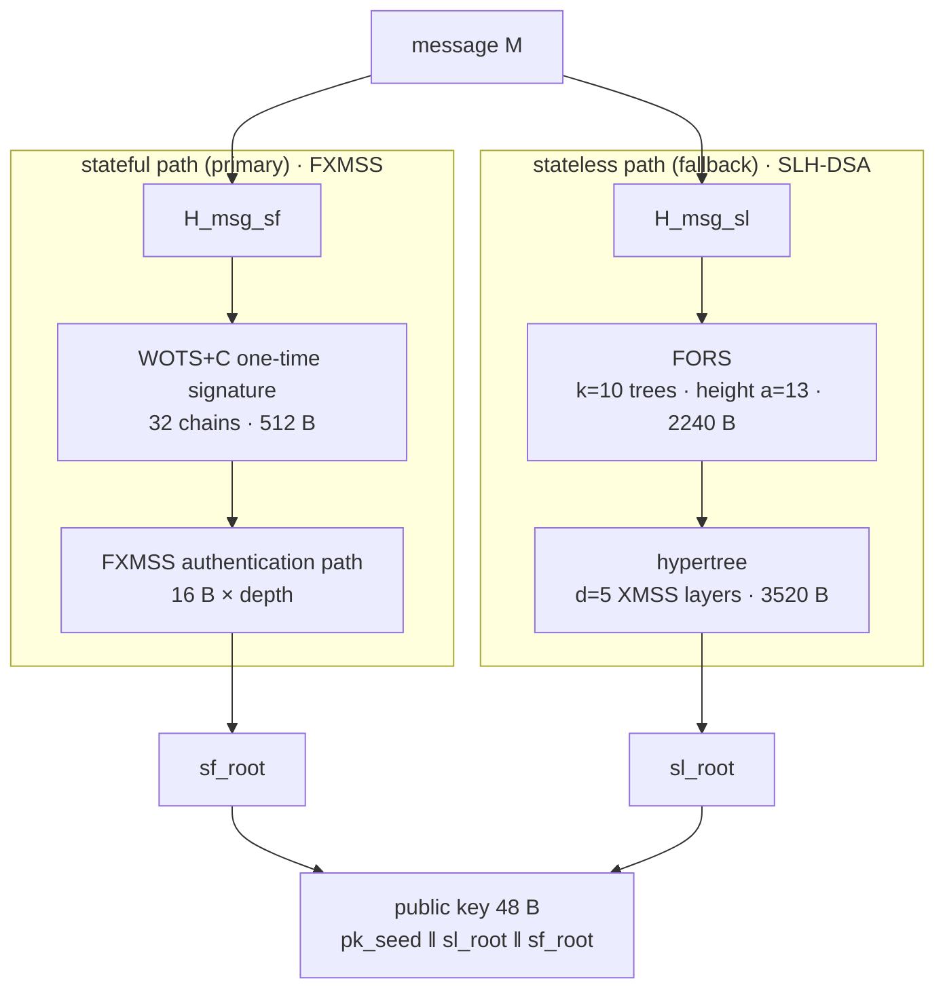
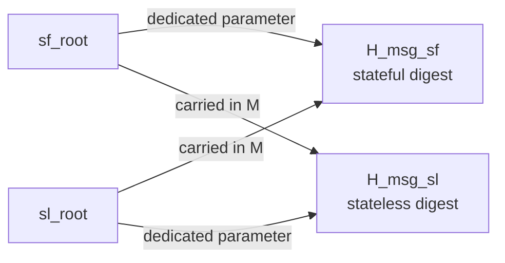
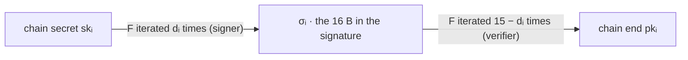
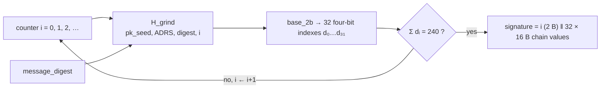
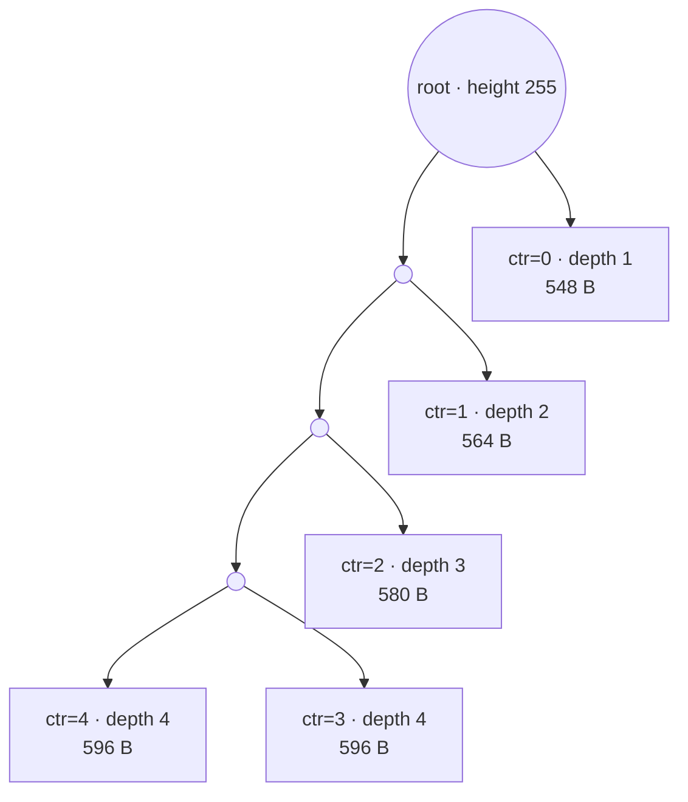
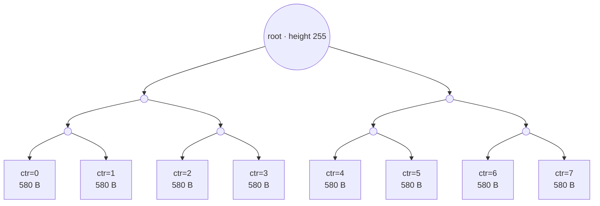
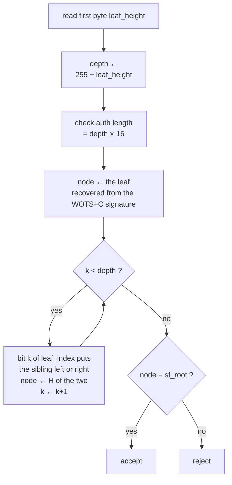

# The construction of SHRINCS, a semi-stateful hash-based signature scheme

> SHRINCS (*Shrunken SPHINCS*) is a cryptographic BIP draft posted to the bitcoin-dev
> mailing list on 27 August 2026. It demotes SLH-DSA, the hash-based signature scheme
> standardised in FIPS 205, to a fallback path, and puts a smaller **stateful** signature
> on the primary path. This note takes the scheme apart along the axes FIPS 205 uses for
> SLH-DSA: what is reused verbatim, what only changes parameters, what is newly
> constructed, and what the design gives up. The specification is at
> <https://github.com/SHRINCS/shrincs-bip/blob/main/SHRINCS.md>.
>
> Status: first draft, marked "Do NOT use in production". Security proofs, test vectors
> and unit tests are all outstanding. Reading this assumes familiarity with FIPS 205:
> hypertrees, XMSS, WOTS+, FORS, and ADRS tweakable hashing.

## 1. Relationship to SLH-DSA

| Layer | Content |
|---|---|
| **Reused verbatim** | The stateless path is SLH-DSA. `slh_dsa_sign` and `slh_dsa_verify` correspond line for line to FIPS 205 Algorithms 22 and 24, differing only in that the signature randomiser is supplied by the caller rather than generated internally. An SLH-DSA implementation that accepts custom parameter sets needs only a thin wrapper |
| **Reparameterised** | The stateless path uses a **non-standard parameter set**: the signature budget drops from 2⁶⁴ to 2⁴⁰, and the signature from 7,856 to 5,776 bytes |
| **Newly constructed** | The stateful path: FXMSS, a Merkle tree of variable shape, over WOTS+C, a constant-sum one-time signature. Neither derives from SPHINCS+ |
| **Shared machinery** | SHA-256 as the sole underlying hash; the ADRS tweakable-hash mechanism; all internal outputs truncated to 16 bytes |

SLH-DSA was designed to be stateless, because SP 800-208 judged XMSS and LMS "not
suitable for general use". SHRINCS moves in the opposite direction: it reintroduces state
in exchange for size, then uses a stateless fallback to reduce the consequence of losing
that state from loss of funds to a larger signature.

## 2. Architecture

| Component | Structure | Path |
|---|---|---|
| **FXMSS**, a Merkle tree signature of variable shape | Hash chains over an **arbitrarily shaped** Merkle tree | Stateful (primary) |
| **WOTS+C**, the one-time signature FXMSS uses | Hash chains with **constant-sum encoding** | Stateful (primary) |
| **SLH-DSA**, the stateless fallback | Hypertree over FORS | Stateless (fallback) |
| WOTS-TW, the one-time signature inside SLH-DSA | Hash chains with a checksum | Stateless (fallback) |
| FORS, a few-time signature | Many small Merkle trees | Stateless (fallback) |

A signature from either path verifies. Signers use the stateful path routinely and fall
back to the stateless path when state is lost, corrupted, or uncertain, as after a
restore from a static backup.

### Signing flow



Each path reduces to a root, and the two roots together form the public key. The two are
not independent of one another; see the cross-binding in section 6.

### Distinguishing the two paths

The first byte of a signature is the discriminator:

- `= 255` (`FXMSS_HEIGHT`) selects the stateless path;
- `0 ≤ x < 255` selects the stateful path, and the byte is the `leaf_height` of the leaf
  that signed.

255 is available as a tag because `leaf_height = 255` corresponds to depth 0, and trees of
depth 0 are forbidden from signing. Length separates the two as well: the stateful maximum
of 4,619 bytes is below the fixed stateless 5,777, giving two independent discriminators.

## 3. Keys

Key generation takes a **48-byte seed** from the caller, split into three 16-byte parts:

```
seed(48) = sk_seed(16) ‖ sk_prf(16) ‖ pk_seed(16)
```

| | Composition | Length |
|---|---|---|
| **Public key** | `pk_seed ‖ sl_root ‖ sf_root` | **48 B** |
| **Secret key** | `sk_seed ‖ sk_prf ‖ pk_seed ‖ sl_root ‖ sf_structure ‖ sf_root` | **82 B** |

| Field | Role |
|---|---|
| `pk_seed` | Public parameter of every tweakable hash |
| `sk_seed` | Derives WOTS-TW, WOTS+C and FORS secret keys |
| `sk_prf` | Derives the message randomiser R |
| `sl_root` | The stateless component: the root of the top XMSS tree of the SLH-DSA hypertree |
| `sf_root` | The stateful component: the FXMSS root, at height 255 |
| `sf_structure` | **2 bytes**, `(shape, depth)`, describing the FXMSS tree; carried only in the secret key |

Both encodings are deliberate:

- truncating the **last 16 bytes** of the public key (`sf_root`) leaves a standard SLH-DSA
  public key for the stateless component under its parameter set;
- truncating the **last 18 bytes** of the secret key (`sf_structure ‖ sf_root`) leaves a
  valid SLH-DSA secret key.

A SHRINCS key is thus a suffix extension of an SLH-DSA key.

## 4. Parameter sets

### Stateful parameters

| Parameter | Value | Meaning |
|---|---|---|
| `WOTS_C_CHAIN_BITS` | 4 | Bits encoded per Winternitz chain (w = 16) |
| `WOTS_C_CHAIN_COUNT` | **32** | Number of Winternitz chains, **with no checksum chains** |
| `FXMSS_HEIGHT` | 255 | The imaginary height of the FXMSS tree, and so the maximum leaf depth |

Derived: `WOTS_C_CONSTANT_SUM = ⌈32 × 15 / 2⌉ = 240`, the target sum of the chain indexes,
which is also their expected value.

### Stateless parameters, against FIPS 205

| Parameter | FIPS 205 name | SHRINCS | SLH-DSA-SHA2-**128s** |
|---|---|---|---|
| Security parameter (bytes) | `n` | 16 | 16 |
| Winternitz | `lg_w` | 4 (w=16) | 4 (w=16) |
| Hypertree layers | `d` | **5** | 7 |
| XMSS height per layer | `h'` | 9 | 9 |
| Total hypertree height | `h` | **45** | 63 |
| FORS tree height | `a` | **13** | 12 |
| FORS tree count | `k` | **10** | 14 |
| Message digest length | `m` | **24** | 30 |
| **Signature budget** | | **2⁴⁰** | 2⁶⁴ |
| **Signature length** | | **5,776 B** | 7,856 B |

WOTS-TW chain counts: `len1 = ⌈128/4⌉ = 32` and `len2 = ⌈bitlen(32×15)/4⌉ = ⌈9/4⌉ = 3`,
for **35** chains, three more than WOTS+C.

The 2,080-byte reduction decomposes exactly:

| Component | SLH-DSA-128s | SHRINCS | Difference |
|---|---|---|---|
| Randomiser R | 16 | 16 | 0 |
| FORS signature, `16·k·(a+1)` | 16×14×13 = 2,912 | 16×10×14 = **2,240** | −672 |
| Hypertree signature, `d × (35×16 + 16×h')` | 7×704 = 4,928 | 5×704 = **3,520** | −1,408 |
| **Total** | **7,856** | **5,776** | **−2,080** |

Two thirds of the saving comes from cutting the budget, which shortens the hypertree, and
one third from reshaping FORS into fewer and taller trees.

The draft notes that SPHINCS+C or PORS+FP would give a further 15 percent at the same 2⁴⁰
budget, and declines both in order to keep FIPS 205 implementation reuse and the existing
security analysis.

## 5. ADRS

As in SLH-DSA, every hash call must be made unique so that an input in one position
cannot be replayed in another to yield the same output. The SHRINCS ADRS is **22 bytes**,
with one interpretation per path:

| Stateless ADRS | Size | | Stateful ADRS | Size |
|---|---|---|---|---|
| `layer` | 1 B | | `node_height` | 1 B |
| `tree_address` | 8 B | | `node_index` | 8 B |
| `type` | 1 B | | `type` | 1 B |
| `payload` | 12 B | | `payload` | 12 B |

The `type` values separate the paths completely, with no numeric overlap:

| Stateless | Value | | Stateful | Value |
|---|---|---|---|---|
| `SL_WOTS_TW_HASH` | 0 | | `SF_WOTS_C_HASH` | 16 |
| `SL_WOTS_TW_PK` | 1 | | `SF_WOTS_C_PK` | 17 |
| `SL_XMSS_TREE` | 2 | | `SF_FXMSS_TREE` | 18 |
| `SL_FORS_TREE` | 3 | | `SF_WOTS_C_PRF` | 21 |
| `SL_FORS_ROOTS` | 4 | | `SF_WOTS_C_GRIND` | 22 |
| `SL_WOTS_TW_PRF` | 5 | | | |
| `SL_FORS_PRF` | 6 | | | |

The first two payload bytes under `SF_WOTS_C_PRF` hold `sf_structure`. That is where the
tree shape enters secret-key derivation; see section 8.

## 6. Hash functions

All are built from SHA-256, in a common form:

```py
sha256(pk_seed ‖ zeros(48) ‖ ADRS ‖ M)[:16]
```

The `zeros(48)` padding brings `pk_seed` (16 bytes) to 64 bytes, exactly one SHA-256
block, so the compression of that block can be precomputed once and reused.

### Tweakable hashes

| Function | Use | Path |
|---|---|---|
| `F` | One step of a hash chain | Both |
| `H` | Combines two Merkle children | Both |
| `T_sl` | Compresses 35 WOTS-TW chain ends into a public key | Stateless |
| `T_sf` | Compresses 32 WOTS+C chain ends into a public key | Stateful |
| `T_k` | Compresses k FORS roots | Stateless |
| `H_grind` | WOTS+C constant-sum grinding | Stateful |

`H_grind` is the one exception, consuming only `ADRS[:10]`:

```py
sha256(pk_seed ‖ zeros(48) ‖ ADRS[:10] ‖ digest ‖ zeros(4) ‖ counter)[:16]
```

This keeps the whole input within a single compression, which matters because grinding
runs up to 2¹⁶ times. One consequence is that the signer holds `sf_structure` in
`ADRS[10:12]` at this point while the verifier leaves those bytes zero; since they fall
outside the consumed window, both sides compute the same value.

### Pseudorandom functions

| Function | Definition | Role |
|---|---|---|
| `PRF(pk_seed, sk_seed, ADRS)` | `sha256(pk_seed ‖ zeros(48) ‖ ADRS ‖ sk_seed)[:16]` | Derives WOTS and FORS secret keys. **Consumes the full 22-byte ADRS** |
| `PRF_msg_sl` / `PRF_msg_sf` | HMAC-SHA256 | Derives the message randomiser R |

### Message digests and the cross-binding

The two message digest functions are structurally symmetric: **each takes its own root as
a dedicated parameter and receives the other path's root inside `M`**.

```py
# stateless: what is actually signed is sf_root ‖ message
#   M = 0x00 ‖ len(ctx) ‖ ctx ‖ sf_root ‖ message
H_msg_sl(R, pk_seed, sl_root, M)

# stateful:
#   M = 0x00 ‖ len(ctx) ‖ ctx ‖ sl_root ‖ message
H_msg_sf(R, pk_seed, sf_root, ADRS, M)
```



The two components are therefore interlocked. Neither root can be lifted out of the
public key and used as a key in its own right, and a signature under one path cannot be
carried over to a different public key.

## 7. WOTS+C: constant-sum encoding in place of a checksum

WOTS+ needs checksum chains because, with message chains alone, an adversary holding
σ = Hᴰ(s) can hash further to Hᴰ′(s) for D′ > D and forge a larger value. The checksum
chain σ₁ = H^(w−1−D)(s₁) makes any increase in D require hashing the checksum chain
backwards, which is infeasible.

WOTS+C takes a different route. It adds no checksum, and instead requires the chain
indexes to sum to a constant.

```
requirement: Σ indexes == WOTS_C_CONSTANT_SUM = 240
```

On a single chain, the signature value σᵢ is the intermediate result of walking dᵢ steps
along the chain from the secret key. A verifier can only continue forwards:



With 32 chains of 4 bits each, over 0–15, the expected index sum is exactly 32×15/2 = 240.
The signer **grinds** a 16-bit counter until the sum lands on it:

```py
for i in range(2**16):
    hashed  = H_grind(pk_seed, ADRS, message_digest, i)
    indexes = base_2b(hashed, 4, 32)
    if sum(indexes) == 240:
        return (i, indexes)     # counter i goes into the signature
```



Grinding fails with probability below 2⁻¹⁴⁵⁰, which is the target the draft's parameters
were chosen against. The verifier recomputes once from the counter in the signature and
rejects if the sum is not 240.

Two consequences follow:

1. **Three chains fewer.** 32 against 35 for WOTS-TW, saving 48 bytes per signature, or
   roughly 8 percent.
2. **Worst-case verification cost equals the average.** Because the index sum is fixed,
   so is the total number of chain steps a verifier walks: Σ(15 − dᵢ) = 32×15 − 240 = 240,
   the same count the signer performs. A consensus verifier can therefore price the worst
   case exactly.

The second claim is the one worth checking rather than taking on faith. The cell below
is the specification's `H_grind`, `base_2b` and `wots_c_map_digest` verbatim, run over 300
messages. It reports how many counters grinding consumed, and the number of chain steps
each side walks.

<div class="sage"><script type="text/x-sage">import hashlib
def sha256(b): return hashlib.sha256(b).digest()
def zeros(n): return bytes(n)
CHAIN_BITS, CHAIN_COUNT = 4, 32
W = 1 << CHAIN_BITS                                   # Winternitz w = 16
TARGET = -(-CHAIN_COUNT * (W - 1) // 2)               # WOTS_C_CONSTANT_SUM = 240
def base_2b(x, b, outlen):                            # FIPS 205 base_2b
    out, j, acc, filled = [], 0, 0, 0
    for _ in range(outlen):
        while filled < b:
            acc = (acc << 8) + x[j]; j += 1; filled += 8
        filled -= b
        out.append((acc >> filled) % (1 << b))
    return out
def H_grind(pk_seed, ADRS, digest, counter):          # as specified
    return sha256(pk_seed + zeros(48) + ADRS[:10] + digest + zeros(4)
                  + int(counter).to_bytes(2, 'big'))[:16]
def wots_c_map_digest(pk_seed, digest, ADRS, counter):
    idx = base_2b(H_grind(pk_seed, ADRS, digest, counter), CHAIN_BITS, CHAIN_COUNT)
    return idx if sum(idx) == TARGET else None
pk_seed = bytes(range(16))
ADRS = bytearray(22); ADRS[9] = 22                    # SF_WOTS_C_GRIND
tries, signer, verifier = [], set(), set()
for m in range(300):
    digest = sha256(("message %d" % m).encode())      # an H_msg_sf output
    for c in range(1 << 16):
        idx = wots_c_map_digest(pk_seed, digest, ADRS, c)
        if idx is not None: break
    tries.append(c + 1)
    signer.add(sum(idx))                              # steps the signer walks
    verifier.add(sum(W - 1 - d for d in idx))         # steps the verifier walks
print("target sum, 32 chains of 4 bits :", TARGET)
print("counters ground, mean / max     : %.1f / %d" % (sum(tries) / len(tries), max(tries)))
print("signer chain steps over 300 msgs:", signer)
print("verifier chain steps, the same  :", verifier)
print("worst case equals average       :", len(verifier) == 1)</script></div>

Grinding costs about 64 hashes on average, which is the reciprocal of the probability
that 32 uniform four-bit values sum to their mean. Both step counts are the single value
240 across every message.

> The same idea, Target-Sum Winternitz, appears in Ethereum's LeanSig, under a different
> motivation. LeanSig needs it because an aggregation circuit is sized for the worst case;
> SHRINCS needs it because consensus must price worst-case verification. The two share an
> author in Mikhail Kudinov.

## 8. FXMSS: an XMSS of signer-chosen shape

### Differences from XMSS

| | XMSS, inside the stateless path | **FXMSS**, the stateful path |
|---|---|---|
| Tree | Always balanced, at fixed height `h' = 9` | **Any shape**; leaves may sit at different depths |
| Leaf OTS | WOTS-TW, 35 chains | **WOTS+C, 32 chains** |
| What is signed | Internal to SLH-DSA: **trusted messages the signer generated** | **A scheme in its own right, signing untrusted messages directly** |

The last row is a security requirement the specification emphasises, and the reason the
two have different interfaces.

### The imaginary height of 255

The root is fixed at height 255, so `depth = 255 − height`. A leaf sits at height 0 only
at the maximum depth of 255. The specification calls 255 imaginary because no real tree
can fill 2²⁵⁶ nodes.

Three properties follow:

1. A leaf `height` occupies **one byte**, is carried in the signature, and gives the
   verifier the depth directly.
2. The authentication path must be **exactly** `depth × 16` bytes, which cross-checks
   against the declared height.
3. 255 never occurs on the stateful path, which frees it as the tag for stateless
   signatures.

### Signature format and size

```
FXMSS signature = 2 (grind counter) + 512 (32 chains × 16 B) + 16 × depth
                = 514 + 16·depth

SHRINCS stateful signature = 1 (leaf_height) + 16 (R)
                           + ⌈min(depth,64)/8⌉ (leaf_index) + FXMSS signature
```

- depth = 1: 1+16+1+530 = **548 B**, the minimum
- depth = 255: 1+16+8+4,594 = **4,619 B**, the maximum

Each additional level adds 16 bytes, and the index field grows by one byte as depth
crosses 8, 16, and so on up to 64. That is the origin of the draft's "16 or 17 bytes per
signature" figure. Beyond depth 64 the index stays at 8 bytes and growth is a steady 16.

### The two prescribed shapes

Shape is described by the two `(shape, depth)` bytes in the secret key, and the leaf is
selected by the state counter.

**UXMSS, left-leaning and unbalanced, `shape = 0`:**

```
ctr <  depth → (index=1, height=255−1−ctr)   ⇒ leaf_depth = ctr+1
ctr == depth → (index=0, height=255−depth)   ⇒ leaf_depth = depth
```

The budget is **depth+1**, with depths 1, 2, …, d, d, the last two equal. Early signatures
are very small and later ones grow linearly. The spine descends on the left (`index = 0`)
and hangs one leaf to the right (`index = 1`) at each level; at the bottom level both
children are leaves. With `depth = 4`, where circles are internal nodes and boxes are
WOTS+C leaves:



**BXMSS, balanced, `shape = 1`:**

```
ctr < 2^depth → (index=ctr, height=255−depth)
```

The budget is **2^depth** and every signature is the same length. With `depth = 3`, all
eight leaves sit on one level and the authentication path is always three siblings:



| Configuration | Signature size | Budget | Key generation (SHA-256 compressions) | Average signing |
|---|---|---|---|---|
| UXMSS d=255 | 548 → 4,619 B | 256 | 425,982 | 133,326 |
| BXMSS d=5 | 612 B | 32 | 309,054 | 16,522 |
| BXMSS d=8 | 660 B | 256 | 425,982 | 133,447 |
| BXMSS d=10 | 693 B | 1,024 | 826,878 | 534,341 |
| BXMSS d=20 | 854 B | 2²⁰ | 547,649,022 | 547,356,475 |

UXMSS at d=255 and BXMSS at d=8 cost the same to generate, both having 256 leaves. Shape
does not change the cost at a given budget; it changes the size curve. UXMSS front-loads
the small signatures, and BXMSS flattens size across all of them.

### Shape-agnostic verification

The verifier never sees `shape`. It reads the first signature byte, derives `depth`, and
climbs that many levels:



`fxmss_pubkey_from_sig` receives only `(leaf_index, leaf_height, signature)`:

```py
assert len(xmss_auth) == leaf_depth * 16          # path length must match the depth
assert leaf_index < 2 ** min(64, leaf_depth)      # index must fit at that depth
node = wots_c_pubkey_from_sig(...)
for k in range(leaf_depth):                        # direction comes from the index bits
    if (leaf_index >> k) & 1: node = H(..., sibling + node)
    else:                     node = H(..., node + sibling)
```

No shape byte is referenced. Whether the tree is UXMSS, BXMSS, or some other shape, the
verifier has a single code path, which bounds what consensus code has to review and
optimise.

The claim that one code path covers every shape is also checkable. The cell below builds
a UXMSS tree of depth 4 and a BXMSS tree of depth 3 using the draft's own `leaf_select`
and leaf predicate, then verifies every signature in both budgets through a single
`verify` that is never given the shape. The WOTS+C leaf is replaced by a hash commitment,
since the preceding cell covers that part; the tree logic, the authentication path and the
climb are as specified.

<div class="sage"><script type="text/x-sage">import hashlib
def sha256(b): return hashlib.sha256(b).digest()
def zeros(n): return bytes(n)
N, FXMSS_HEIGHT = 16, 255
UNBALANCED, BALANCED = 0, 1
SF_WOTS_C_PK, SF_FXMSS_TREE = 17, 18
def adrs(node_depth, node_index, typ):                # stateful ADRS, 22 bytes
    A = bytearray(22)
    A[0] = FXMSS_HEIGHT - node_depth                  # node_height
    A[1:9] = int(node_index).to_bytes(8, 'big')       # node_index
    A[9] = typ
    return bytes(A)
def H(pk, A, M): return sha256(pk + zeros(48) + A + M)[:N]
def leaf_select(shape, depth, ctr):                   # shrincs_sf_leaf_select
    if depth == 0: return None
    if shape == UNBALANCED:
        if ctr == depth: return (0, FXMSS_HEIGHT - depth)
        if ctr <  depth: return (1, FXMSS_HEIGHT - 1 - ctr)
    elif shape == BALANCED:
        if ctr < 2 ** depth: return (ctr, FXMSS_HEIGHT - depth)
    return None                                       # budget exhausted
def is_leaf(shape, depth, nd, ni):                    # the draft's leaf predicate
    return (ni == 1 or nd == depth) if shape == UNBALANCED else nd == depth
def node(pk, sk, shape, depth, nd, ni):
    if is_leaf(shape, depth, nd, ni):                 # stands for the WOTS+C public key
        return H(pk, adrs(nd, ni, SF_WOTS_C_PK), sk)
    l = node(pk, sk, shape, depth, nd + 1, ni * 2)
    r = node(pk, sk, shape, depth, nd + 1, ni * 2 + 1)
    return H(pk, adrs(nd, ni, SF_FXMSS_TREE), l + r)
def sign(pk, sk, shape, depth, ctr):                  # signer knows the shape
    ni, height = leaf_select(shape, depth, ctr)
    nd = FXMSS_HEIGHT - height
    auth = [node(pk, sk, shape, depth, nd - k, (ni >> k) ^ 1) for k in range(nd)]
    return height, ni, auth
def verify(pk, sf_root, leaf, height, leaf_index, auth):
    leaf_depth = FXMSS_HEIGHT - height                # the shape is never consulted
    if len(auth) != leaf_depth: return False          # path length must match depth
    if leaf_index >= 2 ** min(64, leaf_depth): return False
    n = leaf
    for k in range(leaf_depth):                       # direction from the index bits
        A = adrs(leaf_depth - k - 1, leaf_index >> (k + 1), SF_FXMSS_TREE)
        n = H(pk, A, auth[k] + n) if (leaf_index >> k) & 1 else H(pk, A, n + auth[k])
    return n == sf_root
def sig_size(leaf_depth):                             # 1 + R + index + 514 + 16*depth
    return 1 + 16 + -(-min(leaf_depth, 64) // 8) + 514 + 16 * leaf_depth
pk, sk = bytes(range(16)), bytes(range(16, 32))
for shape, depth, name in ((UNBALANCED, 4, "UXMSS"), (BALANCED, 3, "BXMSS")):
    sf_root = node(pk, sk, shape, depth, 0, 0)
    budget = depth + 1 if shape == UNBALANCED else 2 ** depth
    sizes, ok = [], True
    for ctr in range(budget):
        height, ni, auth = sign(pk, sk, shape, depth, ctr)
        nd = FXMSS_HEIGHT - height
        leaf = H(pk, adrs(nd, ni, SF_WOTS_C_PK), sk)
        ok &= verify(pk, sf_root, leaf, height, ni, auth)
        sizes.append(sig_size(nd))
    assert leaf_select(shape, depth, budget) is None  # budget is exactly exhausted
    print("%s depth=%d budget %-2d  all verify: %-5s  sizes %s"
          % (name, depth, budget, bool(ok), sizes))
print("one verifier, never given the shape byte, accepted both trees")</script></div>

The sizes it prints are those in the two figures above, recomputed from
`1 + 16 + ⌈min(depth,64)/8⌉ + 514 + 16·depth` rather than copied.

### Where the shape is bound

Shape is bound into secret-key derivation rather than into verification:

- `fxmss_sign` places `sf_structure` in `ADRS[10:12]`;
- `wots_c_sign` and `wots_c_pubkey_gen` use it when calling `PRF`, and `PRF` consumes the
  **full 22-byte ADRS**, so every chain secret depends on the shape;
- `ADRS[10:14]` is then zeroed, and chain iteration and `T_sf` both run after zeroing, so
  the verifier does not need the shape.

The consequence is that one seed under different `(shape, depth)` values yields entirely
different secrets, leaves and roots. This is domain separation: a wrong shape byte on key
import does not collide with the original tree's secrets, it yields an unusable key.

### Directed trees

The specification argues explicitly against directionless Merkle trees of the kind
Taproot uses. Without a left-right distinction, an adversary holding two nodes at the same
level can run a preimage search against both targets at once, doubling the multi-target
advantage, and the advantage grows with the number of nodes. Direction is therefore given
explicitly by `(leaf_index >> k) & 1`.

## 9. State management

The stateful path selects its leaf by a **state counter**, the number of signatures
issued. Reusing a counter signs two different messages under one WOTS+C key, and anyone
who observes both signatures can forge.

The draft's MUST-level rules:

- the counter must not be backed up or restored, must not be exported or imported, and
  must not be used concurrently;
- it must be persisted **before** the signature is returned;
- when state is uncertain the stateful path must be refused, falling back to the
  stateless one.

Two mitigations distinguish this from XMSS and LMS:

1. **Every key pair carries a stateless fallback by construction.** Losing state costs
   signature size, from 548 to 5,777 bytes, rather than funds.
2. **Leaf reuse is publicly detectable.** Every stateful signature exposes its
   `(index, height)`, so a repeated leaf under one public key can be spotted before the
   second transaction is broadcast.

## 10. Sizes and verification cost

| Item | Size |
|---|---|
| Public key | 48 B |
| Stateful signature | 548 – 4,619 B |
| Stateless signature | 5,777 B |
| **Public key plus signature, minimum** | **596 B** |

For comparison, SLH-DSA-SHA2-128s gives 32 + 7,856 = 7,888 B, a factor of **13.23**, and
ML-DSA-44 gives 1,312 + 2,420 = 3,732 B, a factor of **6.26**, though ML-DSA-44 is
Level 2 where SHRINCS is Level 1.

### Verification cost

| | Compressions | Per byte |
|---|---|---|
| Stateful | 255 – 509 | **0.465** |
| Stateless | 467 – 2,792 | **0.483** |
| BIP-340 Schnorr | ≈127 equivalent | **1.98** |

Per byte this is 4 to 16 times faster than Schnorr. The stateful parameters were tuned to
put the two paths' per-byte costs close together, so that one witness discount rule can
cover both. The draft argues from this for leaving room for a witness discount, without
defining one.

The cost falls elsewhere: key generation runs 3.1×10⁵ to 5.5×10⁸ compressions, and
stateless signing averages 1.7×10⁶.

## 11. Differences from SLH-DSA

| | SLH-DSA-SHA2-128s | SHRINCS |
|---|---|---|
| State | Stateless | **Semi-stateful**: stateful primary with stateless fallback |
| Public key | 32 B | 48 B, adding `sf_root` |
| Signature | 7,856 B | 548–4,619 B primary, 5,777 B fallback |
| One-time signature | WOTS-TW, 35 chains, checksum | **WOTS+C, 32 chains, constant sum**, plus WOTS-TW in the fallback |
| Tree structure | Fixed hypertree, `d=7, h'=9` | **Variable-shape FXMSS**, plus a `d=5, h'=9` hypertree in the fallback |
| Signature budget | 2⁶⁴ | 2⁴⁰ fallback; 32–2²⁰ primary, depending on shape |
| Verification cost | Depends on signer choices | **Worst case equals average** on the primary path |
| Security level | Level 1 | Level 1: 128-bit classical, 64-bit quantum |
| Underlying hash | SHA-2 or SHA-3 | **SHA-256 only**, reusing the hash Bitcoin consensus already has |
| Standardisation | **FIPS 205** | **Draft**, not submitted to the BIPs repository, no security proof |

## 12. Properties the scheme does not provide

The third drawback the draft lists for itself:

> SHRINCS lacks any algebraic structure allowing for **public key rerandomization**,
> **multisignature schemes (like MuSig)**, etc.

There is no counterpart to BIP-32 xpubs and no MuSig-style multisignature. This is common
to hash-based signatures, which have no algebraic structure to aggregate over. For
protocols whose custody rests on n-of-n MuSig2, such as the BitVM2 peg, a post-quantum
replacement is therefore not within the scope of changing an output type.

## 13. Deployment prerequisites

The draft specifies cryptography only, decoupled from consensus validation rules.
Deployment needs at least one further BIP defining a new output type, which this draft
does not define. Test vectors, unit tests, a security proof and an optimised
implementation are all outstanding.

The `Requires` field of BIP-361 reads "TBD Post Quantum Signature BIP". SHRINCS is the
first public candidate for that missing document, and it has not been submitted to the
BIPs repository, so BIP-361 itself remains the only post-quantum entry in the BIPs index.

## Appendix: the working group

Mike Casey (OpenChain), Conduition (Brink), Ethan Heilman (Cloudflare, author of BIP-347
and BIP-360), Mikhail Kudinov (Blockstream), Oleksandr Kurbatov (Blockstream), Boris
Nagaev (independent), Jonas Nick (Blockstream), remix7531 (OpenSats).

The scheme originates in earlier proposals by Jonas Nick and Mikhail Kudinov. Kudinov is
also an author of Ethereum's LeanSig, which is why both lines adopt Target-Sum, or
constant-sum, Winternitz encoding.
